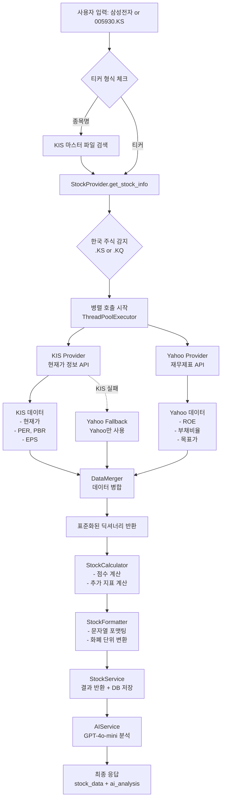
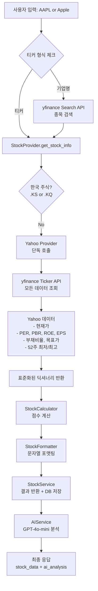

# 주식 데이터 조회 및 분석 흐름도

> **작성일**: 2025-12-30
> **목적**: 국내/해외 종목 검색 로직과 데이터 흐름을 명확히 문서화

---

## 📋 목차
1. [전체 아키텍처 개요](#전체-아키텍처-개요)
2. [국내 종목 (한국 주식) 흐름](#국내-종목-한국-주식-흐름)
3. [해외 종목 (미국/글로벌 주식) 흐름](#해외-종목-미국글로벌-주식-흐름)
4. [성능 최적화 전략](#성능-최적화-전략)
5. [미래 확장 가이드](#미래-확장-가이드)

---

## 🏗️ 전체 아키텍처 개요

```
┌─────────────────────────────────────────────────────────────────┐
│                        Frontend (React)                          │
│  ┌────────────────────────────────────────────────────────────┐ │
│  │  useStockAnalysis Hook                                     │ │
│  │  - 사용자 입력 처리                                          │ │
│  │  - 로딩 상태 관리                                           │ │
│  │  - API 호출 (stockApi.getStockAnalysis)                    │ │
│  └────────────────────────────────────────────────────────────┘ │
└─────────────────────────────────────────────────────────────────┘
                                  │
                                  │ POST /api/v1/stock/analyze
                                  ▼
┌─────────────────────────────────────────────────────────────────┐
│                    Backend (FastAPI)                             │
│  ┌────────────────────────────────────────────────────────────┐ │
│  │  Router Layer (stocks.py)                                  │ │
│  │  1. 캐시 확인 (DB, 1시간 TTL)                               │ │
│  │  2. StockService.get_stock_info() 호출                     │ │
│  │  3. AIService.analyze_stock() 호출                         │ │
│  │  4. 결과 DB 저장 (캐싱)                                     │ │
│  └────────────────────────────────────────────────────────────┘ │
│                                  │                                │
│  ┌────────────────────────────────────────────────────────────┐ │
│  │  Service Layer (StockService)                              │ │
│  │  - 티커 검색/변환                                           │ │
│  │  - StockProvider 호출 (지역별 전략 선택)                    │ │
│  │  - Calculator/Formatter 호출                               │ │
│  │  - DB 저장                                                 │ │
│  └────────────────────────────────────────────────────────────┘ │
│                                  │                                │
│  ┌────────────────────────────────────────────────────────────┐ │
│  │  Provider Layer (전략 패턴)                                 │ │
│  │                                                              │ │
│  │  StockProvider (Router/Context)                             │ │
│  │  ├─ 한국 주식 (.KS, .KQ) → KIS + Yahoo 병렬 호출            │ │
│  │  └─ 해외 주식 (기타) → Yahoo 단독 호출                       │ │
│  └────────────────────────────────────────────────────────────┘ │
└─────────────────────────────────────────────────────────────────┘
                                  │
              ┌───────────────────┼───────────────────┐
              ▼                   ▼                   ▼
     ┌─────────────────┐  ┌──────────────┐  ┌──────────────┐
     │  KIS API        │  │ Yahoo API    │  │ OpenAI API   │
     │  (한국투자증권)  │  │ (yfinance)   │  │ (GPT-4o-mini)│
     └─────────────────┘  └──────────────┘  └──────────────┘
```

---

## 🇰🇷 국내 종목 (한국 주식) 흐름

### 티커 형식
- **KOSPI**: `005930.KS` (삼성전자)
- **KOSDAQ**: `035720.KQ` (카카오)

### 데이터 조회 흐름



### 주요 컴포넌트

#### 1. KIS Provider (한국투자증권 API)
```python
# server/app/services/stock/kis_provider.py
class KisStockProvider(BaseStockProvider):
    """
    한국 주식 전용 Provider
    - 실시간 현재가, PER, PBR, EPS 제공
    - 장중 거래 시간에 높은 정확도
    """
    def get_stock_info(self, ticker: str) -> Dict:
        # 1. 티커 → 종목코드 변환 (005930.KS → 005930)
        stock_code = self._data_parser.convert_ticker_to_stock_code(ticker)

        # 2. KIS API 호출 (FHKST01010100)
        kis_data = self._api_client.get_stock_price_info(stock_code)

        # 3. 표준화된 딕셔너리로 변환
        result = self._data_parser.convert_kis_response_to_standard_format(
            kis_data=kis_data,
            stock_code=stock_code,
            ticker=ticker,
            roe=None,  # Yahoo에서 가져올 것
            target_mean_price=None
        )
        return result
```

**제공 데이터**:
- `current_price`: 현재가
- `pe_ratio`: PER (주가수익비율)
- `pb_ratio`: PBR (주가순자산비율)
- `eps`: EPS (주당순이익)
- `previous_close`: 전일 종가
- `fifty_two_week_low/high`: 52주 최저가/최고가

#### 2. Yahoo Provider (재무제표)
```python
# server/app/services/stock/yahoo_provider.py
class YahooStockProvider(BaseStockProvider):
    """
    글로벌 주식 Provider (한국 주식의 재무제표도 제공)
    """
    def get_financial_data_only(self, ticker: str) -> Dict:
        # yfinance로 재무제표 데이터만 조회
        stock = yf.Ticker(ticker)
        balance_sheet = stock.balance_sheet
        income_stmt = stock.income_stmt

        # ROE, 부채비율, 목표가 계산
        return {
            "roe": self._calculate_roe(income_stmt, balance_sheet),
            "debt_ratio": self._calculate_debt_ratio(balance_sheet),
            "target_mean_price": stock.info.get("targetMeanPrice")
        }
```

**제공 데이터**:
- `roe`: ROE (자기자본이익률)
- `debt_ratio`: 부채비율
- `target_mean_price`: 목표가 (애널리스트 평균)

#### 3. DataMerger (병합)
```python
# server/app/services/stock/data_merger.py
class DataMerger:
    """
    KIS + Yahoo 데이터를 병합하여 완전한 데이터셋 생성
    """
    def merge_with_financial(
        self,
        kis_data: Dict,
        yahoo_financial: Dict
    ) -> Dict:
        # KIS 데이터를 기본으로 사용
        merged = kis_data.copy()

        # Yahoo 재무제표 데이터로 보완
        if "roe" in yahoo_financial and yahoo_financial["roe"]:
            merged["roe"] = yahoo_financial["roe"]

        if "debt_ratio" in yahoo_financial and yahoo_financial["debt_ratio"]:
            merged["debt_ratio"] = yahoo_financial["debt_ratio"]

        if "target_mean_price" in yahoo_financial:
            merged["target_mean_price"] = yahoo_financial["target_mean_price"]

        return merged
```

### 성능 최적화

**병렬 처리 (ThreadPoolExecutor)**:
```python
# server/app/services/stock/provider.py
with ThreadPoolExecutor(max_workers=2) as executor:
    kis_future = executor.submit(self._safe_kis_fetch, ticker)
    yahoo_future = executor.submit(self._safe_yahoo_financial_fetch, ticker)

    # 동시에 두 API 호출 → 50% 시간 단축
    kis_data = kis_future.result()
    yahoo_financial = yahoo_future.result()
```

**시간 절감**:
- **순차 호출**: KIS (1.5초) + Yahoo (1.2초) = 2.7초
- **병렬 호출**: max(1.5초, 1.2초) = 1.5초
- **절감**: 약 44% 시간 단축

---

## 🌍 해외 종목 (미국/글로벌 주식) 흐름

### 티커 형식
- **미국 주식**: `AAPL`, `TSLA`, `MSFT` (접미사 없음)
- **기타 해외**: `7203.T` (도요타, 일본), `0700.HK` (텐센트, 홍콩)

### 데이터 조회 흐름



### 주요 컴포넌트

#### Yahoo Provider (전체 데이터)
```python
# server/app/services/stock/yahoo_provider.py
class YahooStockProvider(BaseStockProvider):
    def get_stock_info(self, ticker: str) -> Dict:
        # yfinance로 모든 데이터 조회
        stock = yf.Ticker(ticker)

        # 1. 기본 정보 (info)
        info = stock.info

        # 2. fast_info로 핵심 데이터 보완
        fast_info = stock.fast_info

        # 3. 재무제표 (balance_sheet, income_stmt)
        balance_sheet = stock.balance_sheet
        income_stmt = stock.income_stmt

        # 4. 표준화된 딕셔너리 생성
        return {
            "currency": "USD",
            "current_price": fast_info.last_price,
            "pe_ratio": info.get("trailingPE"),
            "pb_ratio": info.get("priceToBook"),
            "roe": self._calculate_roe(income_stmt, balance_sheet),
            "eps": info.get("trailingEps"),
            "debt_ratio": self._calculate_debt_ratio(balance_sheet),
            "target_mean_price": info.get("targetMeanPrice"),
            # ... 기타 필드
        }
```

**제공 데이터** (한국 주식과 동일한 표준화된 형식):
- 모든 재무지표를 Yahoo Finance에서 조회
- 단일 소스이므로 병합 불필요

---

## ⚡ 성능 최적화 전략

### 1. DB 캐싱 (1시간 TTL)

```python
# server/app/api/v1/endpoints/stocks.py
@router.post("/analyze")
async def analyze_stock(...):
    # 1. 캐시 확인
    cache_valid_until = datetime.utcnow() - timedelta(hours=1)
    cached_log = db.query(StockAnalysisLog).filter(
        StockAnalysisLog.ticker == ticker,
        StockAnalysisLog.updated_at >= cache_valid_until
    ).first()

    if cached_log and cached_log.analysis_json:
        # 캐시 적중 → AI 분석 포함 즉시 반환
        stock_data = cached_log.analysis_json.get("stock_data")
        ai_analysis = cached_log.analysis_json.get("ai_analysis")
        return StockAnalysisResponse(stock_data=stock_data, ai_analysis=ai_analysis)

    # 2. 캐시 미스 → 새로 조회
    stock_data = stock_service.get_stock_info(ticker, db)
    ai_analysis = ai_service.analyze_stock(stock_data)

    # 3. DB 저장 (다음 조회 시 캐시 적중)
    db.add(StockAnalysisLog(
        ticker=ticker,
        analysis_json={"stock_data": stock_data, "ai_analysis": ai_analysis}
    ))
    db.commit()
```

**시간 절감**:
- **캐시 미스**: 7초 (KIS + Yahoo + AI)
- **캐시 적중**: 0.1초 (DB 조회만)
- **절감**: 98.6% 시간 단축

### 2. 병렬 API 호출 (한국 주식)

```python
# server/app/services/stock/provider.py
# KIS + Yahoo를 동시에 호출
with ThreadPoolExecutor(max_workers=2) as executor:
    kis_future = executor.submit(self._safe_kis_fetch, ticker)
    yahoo_future = executor.submit(self._safe_yahoo_financial_fetch, ticker)

    kis_data = kis_future.result()
    yahoo_financial = yahoo_future.result()
```

**시간 절감**: 약 44% (2.7초 → 1.5초)

### 3. 프론트엔드 최적화

```typescript
// client/src/hooks/useStockAnalysis.ts
// search API 호출 생략, 바로 analyze API 호출
const response = await stockApi.getStockAnalysis({ ticker: originalQuery })
```

**시간 절감**:
- **이전**: search (0.5초) + analyze (7초) = 7.5초
- **현재**: analyze (5초) = 5초
- **절감**: 33% 시간 단축 (백엔드가 자동 변환 처리)

### 4. AI 응답 최적화

```python
# server/app/services/ai_service.py
class AIService:
    def __init__(self, api_key: str, model: str = "gpt-4o-mini"):
        self.temperature = 0.6  # 자연스러운 톤 + 일관성
        self.max_tokens = 600   # 응답 길이 제한
```

**시간 절감**:
- GPT-4o-mini 사용 (GPT-4 대비 10배 빠름)
- max_tokens 제한 (불필요한 생성 방지)
- Structured Outputs (JSON 파싱 속도 향상)

---

## 🚀 미래 확장 가이드

### 미국 시장 특화 Provider 추가

#### 1. USStockProvider 클래스 생성

```python
# server/app/services/stock/us_provider.py
from .base_provider import BaseStockProvider

class USStockProvider(BaseStockProvider):
    """
    미국 주식 전용 Provider (Alpha Vantage, IEX Cloud 등 사용 가능)
    """
    def __init__(self):
        self.api_key = "YOUR_ALPHA_VANTAGE_KEY"

    def get_stock_info(self, ticker: str) -> Dict:
        # Alpha Vantage API 호출
        # 표준화된 딕셔너리 반환
        return {
            "currency": "USD",
            "current_price": ...,
            "pe_ratio": ...,
            # ... 기타 필드
        }
```

#### 2. StockProvider에 미국 주식 분기 추가

```python
# server/app/services/stock/provider.py
class StockProvider:
    def __init__(self):
        self._yahoo_provider = YahooStockProvider()
        self._kis_provider = KisStockProvider()
        self._us_provider = USStockProvider()  # 추가

    def get_stock_info(self, ticker: str) -> Dict:
        ticker_upper = ticker.upper()
        is_korean = ticker_upper.endswith((".KS", ".KQ"))
        is_us = self._is_us_ticker(ticker_upper)  # 미국 주식 체크

        if is_korean:
            # 한국 주식 로직
            ...
        elif is_us:
            # 미국 주식 전용 Provider 사용
            logger.info(f"[StockProvider] 미국 주식 감지: {ticker} -> US Provider 사용")
            return self._us_provider.get_stock_info(ticker)
        else:
            # 기타 해외 주식 (Yahoo)
            return self._yahoo_provider.get_stock_info(ticker)

    @staticmethod
    def _is_us_ticker(ticker: str) -> bool:
        """미국 주식인지 확인 (나스닥, NYSE 등)"""
        # 미국 주식 티커 목록 체크 또는 정규식 사용
        us_exchanges = ["NASDAQ", "NYSE", "AMEX"]
        # 간단한 체크: 대문자 영문자만 있는 경우
        return ticker.isalpha() and ticker.isupper()
```

### 추가 API 통합 예시

#### Alpha Vantage API 통합
```python
# server/app/services/stock/alpha_vantage_provider.py
import requests
from .base_provider import BaseStockProvider

class AlphaVantageProvider(BaseStockProvider):
    BASE_URL = "https://www.alphavantage.co/query"

    def get_stock_info(self, ticker: str) -> Dict:
        # 1. 현재가 조회
        params = {
            "function": "GLOBAL_QUOTE",
            "symbol": ticker,
            "apikey": self.api_key
        }
        response = requests.get(self.BASE_URL, params=params)
        data = response.json()["Global Quote"]

        # 2. 표준화된 딕셔너리로 변환
        return {
            "currency": "USD",
            "current_price": float(data["05. price"]),
            "previous_close": float(data["08. previous close"]),
            # ... 기타 필드 매핑
        }
```

### 표준화된 데이터 형식 (모든 Provider 공통)

```python
{
    # 필수 필드
    "currency": str,              # "KRW" | "USD" | "JPY" | ...
    "current_price": float,       # 현재가
    "name": str,                  # 종목명
    "symbol": str,                # 티커 심볼

    # 재무지표
    "pe_ratio": Optional[float],  # PER
    "pb_ratio": Optional[float],  # PBR
    "roe": Optional[float],       # ROE (%)
    "eps": Optional[float],       # EPS
    "debt_ratio": Optional[float], # 부채비율 (%)

    # 가격 범위
    "previous_close": Optional[float],
    "fifty_two_week_low": Optional[float],
    "fifty_two_week_high": Optional[float],

    # 목표가
    "target_mean_price": Optional[float],

    # 기타
    "sector": str,                # 섹터
    "industry": str,              # 산업
    "market_cap": Optional[str],  # 시가총액 (문자열)
    "beta": Optional[float],      # 베타 (변동성)
}
```

---

## 📊 성능 요약

| 구분 | 최적화 전 | 최적화 후 | 개선율 |
|------|----------|----------|--------|
| **첫 검색 (캐시 미스)** | 7.5초 | 5초 | 33% ↓ |
| **재검색 (캐시 적중)** | 7초 | 0.1초 | 98.6% ↓ |
| **병렬 호출 (한국 주식)** | 2.7초 | 1.5초 | 44% ↓ |
| **프론트엔드 (search 생략)** | 0.5초 | 0초 | 100% ↓ |

**총 개선**: 7.5초 → 5초 (첫 검색), 7초 → 0.1초 (재검색)

---

## 🔧 주요 파일 목록

### Backend

| 파일 | 역할 |
|------|------|
| `server/app/api/v1/endpoints/stocks.py` | API 라우터 (캐싱, 응답 처리) |
| `server/app/services/stock/service.py` | StockService (Facade) |
| `server/app/services/stock/provider.py` | StockProvider (지역별 전략 선택) |
| `server/app/services/stock/kis_provider.py` | KIS API Provider (한국 주식) |
| `server/app/services/stock/yahoo_provider.py` | Yahoo API Provider (글로벌 주식) |
| `server/app/services/stock/data_merger.py` | 데이터 병합 로직 |
| `server/app/services/stock/calculator.py` | 재무지표 계산 |
| `server/app/services/stock/formatter.py` | 문자열 포맷팅 |
| `server/app/services/ai_service.py` | AI 분석 (OpenAI) |

### Frontend

| 파일 | 역할 |
|------|------|
| `client/src/hooks/useStockAnalysis.ts` | 주식 분석 Hook (API 호출) |
| `client/src/api/stockApi.ts` | API Client (Singleton) |
| `client/src/components/PriceRangeBar.tsx` | 52주 범위 시각화 |

---

**마지막 수정**: 2025-12-30
**작성자**: Claude (AI Assistant)
